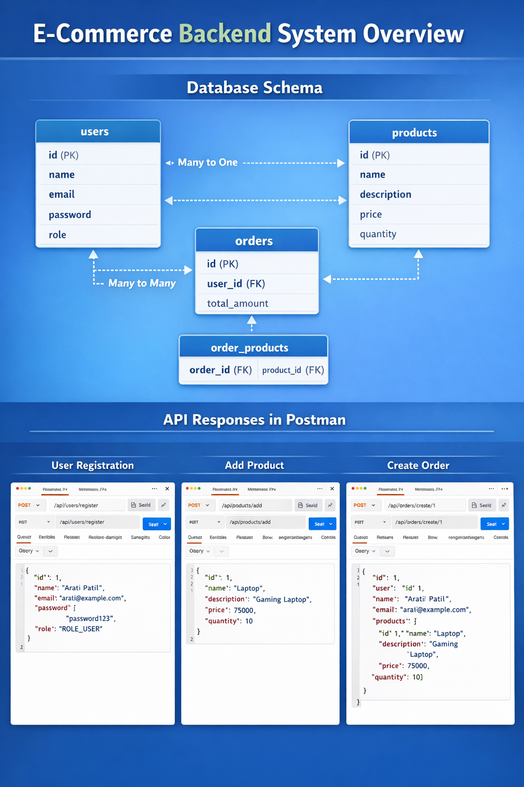

# Ecommerce-backend-system
🛒 E-Commerce Backend System
📌 Project Description

The E-Commerce Backend System is a RESTful web application developed using Java, Spring Boot, and MySQL.
This project provides backend APIs to manage users, products, and orders for an e-commerce platform.

The system allows users to register, browse products, and place orders. The application follows a layered architecture (Controller → Service → Repository → Database) and uses Spring Data JPA for database operations.

The APIs are tested using Postman, and the data is stored in a MySQL database.

This project demonstrates practical knowledge of Spring Boot backend development, REST API design, and database integration, similar to real-world e-commerce systems.

⚙️ Tech Stack
Backend

Java

Spring Boot

Spring Web

Spring Data JPA

Lombok

Database

MySQL

Tools

Postman (API testing)

Maven

Git & GitHub

Spring Tool Suite / IntelliJ IDEA
🚀 Features

✔ User Registration
✔ Product Management (Add / View / Delete Products)
✔ Order Creation and Management
✔ RESTful API architecture
✔ MySQL database integration
✔ API testing with Postman

## project Structure
ecommerce-backend
│
├── controller
│   ├── UserController
│   ├── ProductController
│   └── OrderController
│
├── service
│   ├── UserService
│   ├── ProductService
│   └── OrderService
│
├── repository
│   ├── UserRepository
│   ├── ProductRepository
│   └── OrderRepository
│
├── entity
│   ├── User
│   ├── Product
│   └── Order
│
└── application.properties

## API Endpoints
1️⃣ Register User
/api/users/register
2️⃣ Add Product
/api/products/add
3️⃣ Get All Products
/api/products/all
4️⃣ Create Order
/api/orders/create/{userId}
5️⃣ Get All Orders
/api/orders/all

🧪 API Testing

All APIs are tested using Postman.

Example workflow:

1️⃣ Register User
2️⃣ Add Products
3️⃣ Fetch Product List
4️⃣ Create Order
5️⃣ View Orders

## sample output
{
 "id":1,
 "user":{
  "id":1,
  "name":"Arati Patil"
 },
 "products":[
  {
   "id":1,
   "name":"Laptop",
   "price":75000
  }
 ],
 "totalAmount":75000
}

👩‍💻 Roles & Responsibilities

Designed and developed RESTful APIs using Spring Boot.

Implemented CRUD operations for product management.

Developed user registration functionality with database persistence.

Implemented order creation logic with product relationships.

Integrated MySQL database using Spring Data JPA.

Structured the project using Controller, Service, and Repository layers.

Tested all APIs using Postman to ensure correct functionality.

Used Git and GitHub for version control and project management.

📌 Future Improvements

Implement JWT Authentication

Add Spring Security

Develop Frontend using ReactJS

Add Payment Gateway Integration

Implement Order Tracking System
-
**Database Schema**

-

